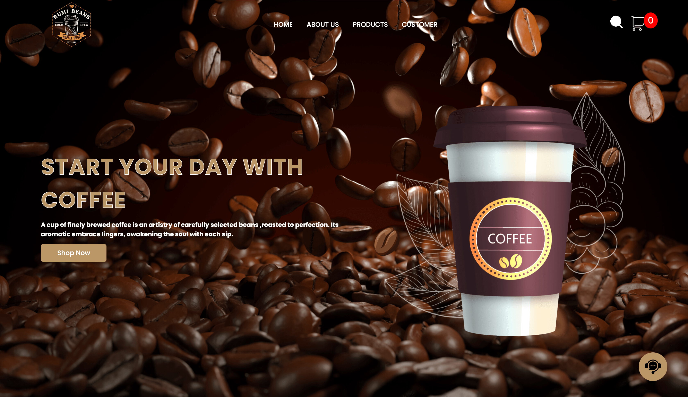
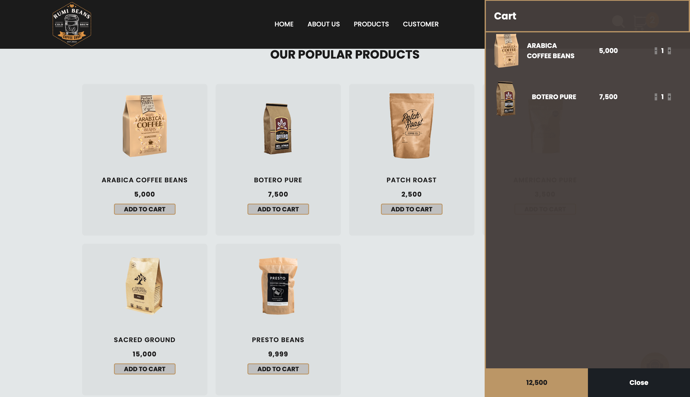
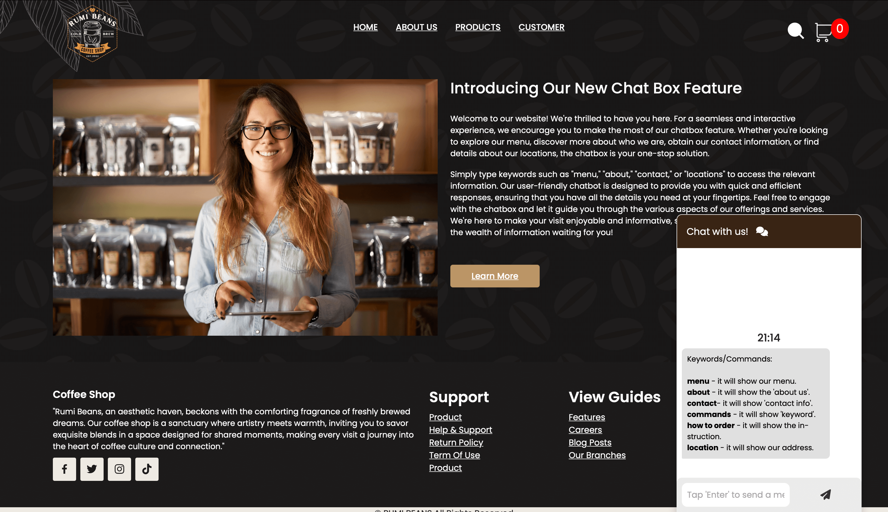

# ☕ Rumi Beans — Coffee Shop Website

Welcome to **Rumi Beans**, a modern and stylish coffee shop website built using **HTML**, **CSS**, and **JavaScript**.  
The website features a **functional shopping cart** and a **real-time chatbox** to enhance user experience.

---

## ✨ Features

- 🛒 Fully functional **shopping cart** (add, remove, and update items).
- 💬 **Chatbox** for customer support and live interaction.
- 🎨 Stylish and responsive design.
- 📱 Mobile-friendly layout for all devices.
- ⚡ Fast and smooth navigation.

---

## 🛠️ Technologies Used

- **HTML5** — Structure of the web pages.
- **CSS3** — Styling and layout.
- **JavaScript** — Interactivity (cart functionality, chatbox, etc.).

---

## 📸 Screenshots

| Home Page | Cart Page | Chatbox |
|:---------:|:---------:|:-------:|
|  |  |  |

---

## 🚀 Getting Started

1. Clone the repository:
   ```bash
   git clone https://github.com/your-username/rumi-beans.git
   ```

2. Open the project folder:
   ```bash
   cd rumi-beans
   ```

3. Open `index.html` in your browser to view the website.
